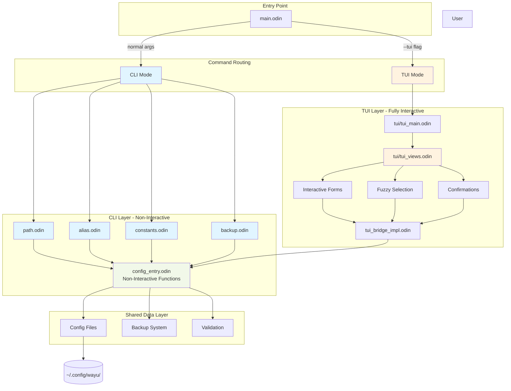
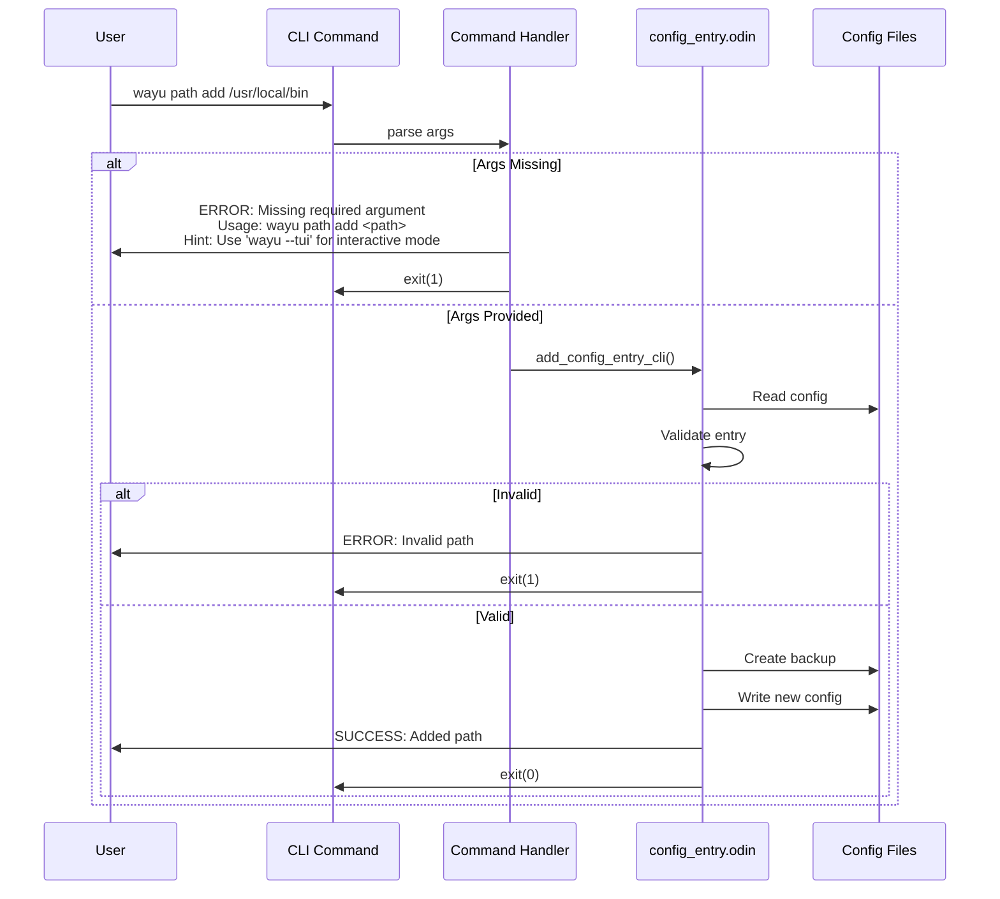
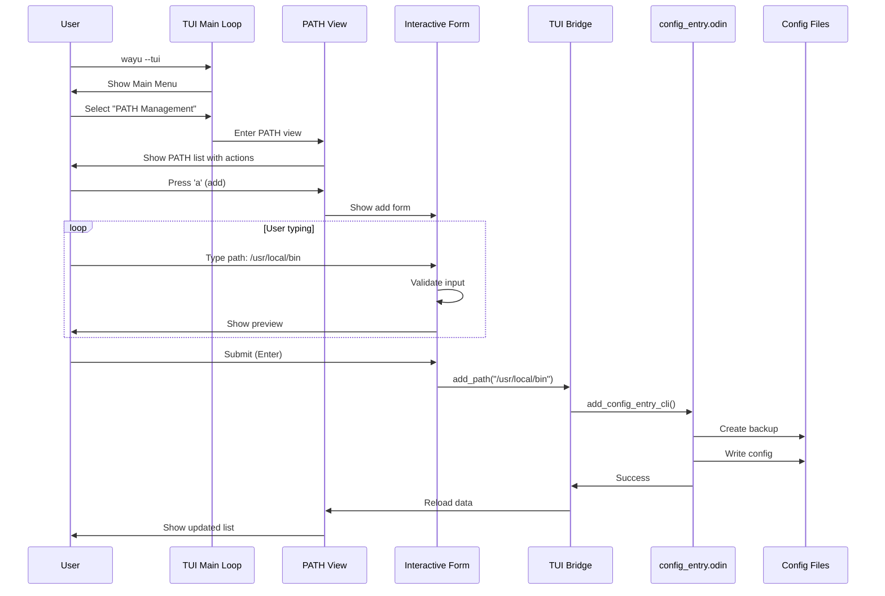

# PRP-13: CLI/TUI Isolation - Complete Separation of Interactive and Non-Interactive Modes

**Status**: PLANNING
**Priority**: HIGH
**Impact**: BREAKING CHANGES
**Estimated Effort**: 12-16 hours over 1 week
**Version Target**: v2.2.0

---

## Executive Summary

wayu currently has interactive features embedded in CLI commands (fuzzy selection, confirmation prompts, interactive forms) that break the Unix philosophy of composable, scriptable tools. This PRP establishes complete separation between CLI (non-interactive, scriptable) and TUI (fully interactive) modes.

**Key Goals:**
1. Remove ALL interactivity from CLI commands
2. Make CLI commands fully scriptable and automation-friendly
3. Consolidate interactive features exclusively in TUI mode
4. Follow Unix best practices (stdin/stdout/stderr, exit codes, pipeable)
5. Maintain backward compatibility where possible with feature flags

---

## Problem Statement

### Current Issues

1. **CLI Commands Have Interactive Fallbacks**
   - `wayu path rm` without args → fuzzy selection
   - `wayu alias add` without args → interactive form
   - `wayu path clean` → confirmation prompt
   - `wayu path dedup` → confirmation prompt
   - Backup failures → "Continue anyway? [y/N]" prompt

2. **Breaks Scriptability**
   ```bash
   # These hang in scripts/CI:
   echo "y" | wayu path clean        # stdin not connected to terminal
   wayu path rm | tee log.txt        # fuzzy finder fails without TTY
   ```

3. **Violates Unix Philosophy**
   - Interactive prompts break pipes
   - Cannot automate batch operations
   - No way to disable interactivity globally
   - Poor integration with automation tools

4. **Inconsistent UX**
   - Some commands require args, others fall back to interactive
   - Users don't know which mode they're in
   - TUI mode exists but CLI still has interactive features

### Why This Matters

**For Automation:**
- CI/CD pipelines need predictable, non-interactive commands
- Shell scripts require explicit arguments
- Configuration management tools (Ansible, Chef) need scriptable CLIs

**For Users:**
- Clear separation: CLI for scripts, TUI for humans
- Predictable behavior in both modes
- Better error messages

**For Maintenance:**
- Simpler codebase with clear boundaries
- Easier to test non-interactive operations
- Reduced complexity in command handlers

---

## Solution Architecture

### Design Principles

1. **CLI = Non-Interactive**
   - Always require explicit arguments
   - Never prompt for user input
   - Error early with helpful messages
   - Support `--force`, `--yes` flags for confirmations

2. **TUI = Fully Interactive**
   - All interactive operations in TUI mode
   - Rich UI with forms, selections, confirmations
   - User-friendly error handling
   - Guided workflows

3. **Clean Boundaries**
   - Shared data layer (config_entry.odin)
   - Separate UI layer (CLI vs TUI)
   - No cross-contamination

### Architecture Diagram



### Data Flow: CLI Commands



### Data Flow: TUI Mode



---

## User Stories

### Epic 1: Non-Interactive CLI

#### Story 1.1: PATH Operations Require Arguments
**As a** DevOps engineer
**I want** PATH commands to require explicit arguments
**So that** I can use them in automation scripts

**Acceptance Criteria:**
- [ ] `wayu path add` without args → error with usage hint
- [ ] `wayu path rm` without args → error with usage hint
- [ ] Error message suggests TUI mode: "Hint: Use 'wayu --tui' for interactive mode"
- [ ] Exit code 1 on missing args
- [ ] Can pipe output: `wayu path list | grep local`

**Example:**
```bash
# Before (hangs in script):
wayu path rm  # Opens interactive fuzzy selector

# After (fails fast):
$ wayu path rm
ERROR: Missing required argument: path

Usage: wayu path rm <path>

Remove a PATH entry from your configuration.

Examples:
  wayu path rm /usr/local/bin
  wayu path rm '$HOME/bin'

Hint: For interactive selection, use: wayu --tui
$ echo $?
1
```

#### Story 1.2: Alias/Constants Operations Require Arguments
**As a** system administrator
**I want** alias and constants commands to require all arguments
**So that** I can automate user setups

**Acceptance Criteria:**
- [ ] `wayu alias add` without args → error (no interactive form)
- [ ] `wayu alias add NAME` (missing command) → error
- [ ] `wayu constants add` without args → error
- [ ] All error messages show full usage
- [ ] Exit code 1 on missing args

**Example:**
```bash
# Before (opens interactive form):
wayu alias add

# After (fails fast):
$ wayu alias add
ERROR: Missing required arguments: name and command

Usage: wayu alias add <name> <command>

Examples:
  wayu alias add ll "ls -la"
  wayu alias add gst "git status"

Hint: For interactive mode, use: wayu --tui
```

#### Story 1.3: Confirmation Prompts Use Flags
**As a** CI pipeline
**I want** to use `--yes` or `--force` flags for confirmations
**So that** I don't need interactive input

**Acceptance Criteria:**
- [ ] `wayu path clean` requires `--yes` flag (no prompt)
- [ ] `wayu path dedup` requires `--yes` flag
- [ ] Backup failures in CLI mode fail immediately (no "Continue? [y/N]")
- [ ] Error message suggests using `--yes` flag
- [ ] All operations atomic (fail early or succeed completely)

**Example:**
```bash
# Before (prompts):
$ wayu path clean
Found 3 missing directories:
  - /nonexistent/path
Continue? [y/N]: _

# After (requires flag):
$ wayu path clean
ERROR: This operation requires confirmation.

Found 3 missing directories to remove:
  - /nonexistent/path

Add --yes flag to proceed:
  wayu path clean --yes

$ wayu path clean --yes
✅ Removed 3 missing directories from PATH
```

### Epic 2: TUI Mode Consolidation

#### Story 2.1: TUI is Primary Interactive Mode
**As a** end user
**I want** a rich interactive experience in TUI mode
**So that** I can manage configuration visually

**Acceptance Criteria:**
- [ ] TUI has all interactive operations (add, remove, edit, list)
- [ ] Fuzzy selection for all list operations
- [ ] Interactive forms for add/edit with live validation
- [ ] Confirmation dialogs for destructive operations
- [ ] Help overlays showing keyboard shortcuts
- [ ] No TTY checks in TUI (TUI already requires TTY)

#### Story 2.2: TUI Navigation is Intuitive
**As a** new user
**I want** clear navigation in TUI
**So that** I can discover features easily

**Acceptance Criteria:**
- [ ] Main menu shows all available operations
- [ ] Every view shows keyboard shortcuts
- [ ] "Press 'h' for help" always visible
- [ ] Breadcrumbs show current location
- [ ] Esc key returns to previous view

### Epic 3: Migration & Documentation

#### Story 3.1: Clear Migration Guide
**As an** existing wayu user
**I want** guidance on migrating scripts
**So that** my automation doesn't break

**Acceptance Criteria:**
- [ ] Migration guide in docs/ with all breaking changes
- [ ] Examples of old vs new commands
- [ ] Script migration checklist
- [ ] Version check warns about deprecated usage

#### Story 3.2: Helpful Error Messages
**As a** user running old commands
**I want** errors to guide me to correct usage
**So that** I can fix my scripts quickly

**Acceptance Criteria:**
- [ ] All errors show correct syntax
- [ ] Errors suggest TUI for interactive operations
- [ ] Exit codes documented (0=success, 1=error, 2=usage error)

---

## Technical Implementation

### Phase 1: Remove Interactive Fallbacks (4 hours)

**File: src/config_entry.odin**

**Changes:**
1. **Remove interactive functions from CLI path:**
   - Remove `add_config_interactive()` call in `handle_config_command`
   - Remove `remove_config_interactive()` call
   - Remove `list_config_interactive()` call (keep for TUI only)

2. **Add CLI-specific handlers:**
```odin
// CLI-only handlers (no interactivity)
handle_config_command :: proc(spec: ^ConfigEntrySpec, action: Action, args: []string) {
    #partial switch action {
    case .ADD:
        if len(args) == 0 {
            // ERROR: Missing args
            print_cli_usage_error(spec, "add")
            os.exit(2)  // Exit code 2 = usage error
        }
        entry := parse_args_to_entry(spec, args)
        defer cleanup_entry(&entry)

        if !is_entry_complete(entry) {
            print_cli_usage_error(spec, "add")
            os.exit(2)
        }

        add_config_entry_cli(spec, entry)

    case .REMOVE:
        if len(args) == 0 {
            // ERROR: Missing args
            print_cli_usage_error(spec, "remove")
            os.exit(2)
        }
        remove_config_entry_cli(spec, args[0])

    case .LIST:
        // LIST is always OK without args
        if len(args) > 0 && args[0] == "--static" {
            list_config_static(spec)
        } else {
            list_config_static(spec)  // Default to static in CLI
        }

    case .HELP:
        print_config_help(spec)
    case .UNKNOWN:
        fmt.eprintfln("Unknown %s action", spec.display_name)
        print_config_help(spec)
        os.exit(1)
    }
}

// New: Print usage error with hint to TUI
print_cli_usage_error :: proc(spec: ^ConfigEntrySpec, action: string) {
    print_error("Missing required arguments for '%s %s'", spec.file_name, action)
    fmt.println()

    // Show usage based on action
    switch action {
    case "add":
        if spec.fields_count == 1 {
            fmt.printfln("Usage: wayu %s add <%s>", spec.file_name, spec.field_labels[0])
            fmt.println()
            fmt.printfln("Example:")
            fmt.printfln("  wayu %s add %s", spec.file_name, spec.field_placeholders[0])
        } else {
            fmt.printfln("Usage: wayu %s add <%s> <%s>", spec.file_name, spec.field_labels[0], spec.field_labels[1])
            fmt.println()
            fmt.printfln("Example:")
            fmt.printfln("  wayu %s add %s %s", spec.file_name, spec.field_placeholders[0], spec.field_placeholders[1])
        }
    case "remove":
        fmt.printfln("Usage: wayu %s rm <%s>", spec.file_name, spec.field_labels[0])
        fmt.println()
        fmt.printfln("Example:")
        fmt.printfln("  wayu %s rm %s", spec.file_name, spec.field_placeholders[0])
    }

    fmt.println()
    fmt.printfln("%sHint:%s For interactive mode, use: %swayu --tui%s",
        get_muted(), RESET, get_primary(), RESET)
}
```

3. **Rename functions to indicate mode:**
   - `add_config_entry()` → `add_config_entry_cli()` (no interactivity)
   - `remove_config_entry()` → `remove_config_entry_cli()` (no interactivity)
   - Keep `add_config_interactive()` → only called from TUI bridge
   - Keep `remove_config_interactive()` → only called from TUI bridge

**File: src/path.odin**

**Changes:**
1. **Add `--yes` flag to clean/dedup:**
```odin
// Clean missing paths - requires --yes flag in CLI
clean_missing_paths :: proc(args: []string) {
    // Check for --yes flag
    has_yes := false
    for arg in args {
        if arg == "--yes" || arg == "-y" {
            has_yes = true
            break
        }
    }

    // ... find missing entries ...

    if len(missing_entries) == 0 {
        print_success("✅ No missing directories found in PATH")
        return
    }

    // Show what will be removed
    print_header("Clean Missing PATH Entries", "🧹")
    fmt.println()
    fmt.printfln("Found %d missing directories:", len(missing_entries))
    for entry in missing_entries {
        fmt.printfln("  - %s", entry.name)
    }
    fmt.println()

    if !has_yes {
        // ERROR: Requires --yes flag
        print_error("This operation requires confirmation.")
        fmt.println()
        fmt.printfln("Add --yes flag to proceed:")
        fmt.printfln("  wayu path clean --yes")
        os.exit(1)
    }

    // Proceed with cleanup...
}
```

2. **Same pattern for dedup:**
```odin
remove_duplicate_paths :: proc(args: []string) {
    // Check for --yes flag
    has_yes := false
    for arg in args {
        if arg == "--yes" || arg == "-y" {
            has_yes = true
            break
        }
    }

    // ... rest of implementation ...
}
```

**File: src/backup.odin**

**Changes:**
1. **Remove confirmation prompt in CLI:**
```odin
// Create backup - CLI version fails immediately if backup fails
create_backup_cli :: proc(file_path: string) -> bool {
    backup_path, ok := create_backup(file_path)
    defer if ok do delete(backup_path)

    if !ok {
        print_error("Failed to create backup for %s", file_path)
        fmt.println("Aborting operation to prevent data loss.")
        return false
    }

    return true
}

// TUI version can still prompt (called from TUI bridge)
create_backup_with_prompt :: proc(file_path: string) -> bool {
    // ... existing implementation for TUI ...
}
```

### Phase 2: Update TUI Bridge (2 hours)

**File: src/tui_bridge_impl.odin**

**Changes:**
1. **TUI bridge calls interactive versions:**
```odin
// TUI bridge uses interactive functions
tui_add_path_impl :: proc(path: string) -> bool {
    // Can use interactive confirmations here
    entry := ConfigEntry{
        type = .PATH,
        name = strings.clone(path),
        value = "",
    }
    defer cleanup_entry(&entry)

    // This version can prompt for backup failures
    add_config_entry_tui(&PATH_SPEC, entry)
    return true
}

// New: TUI version with interactive confirmations
add_config_entry_tui :: proc(spec: ^ConfigEntrySpec, entry: ConfigEntry) {
    // Validate
    validation_result := spec.validator(entry)
    if !validation_result.valid {
        print_error("%s", validation_result.error_message)
        delete(validation_result.error_message)
        return  // Don't exit in TUI, just return
    }

    // ... rest same as CLI version but can prompt ...

    // Create backup with prompt on failure
    if !create_backup_with_prompt(config_file) {
        print_info("Operation cancelled")
        return  // Don't exit, return to TUI
    }

    // ... rest of write operation ...
}
```

### Phase 3: Update Main Entry Point (2 hours)

**File: src/main.odin**

**Changes:**
1. **Add better flag parsing:**
```odin
// Parse flags
tui_mode := false
dry_run := false
yes_flag := false

// ... existing arg parsing ...

// Check for --yes flag globally
for arg in os.args[1:] {
    if arg == "--yes" || arg == "-y" {
        yes_flag = true
    }
}

// Store in global (or pass through)
GLOBAL_YES_FLAG = yes_flag
```

2. **Pass flags to handlers:**
```odin
handle_path_command :: proc(action: Action, args: []string) {
    #partial switch action {
    case .CLEAN:
        clean_missing_paths(args)  // Pass args for --yes check
    case .DEDUP:
        remove_duplicate_paths(args)  // Pass args for --yes check
    case:
        handle_config_command(&PATH_SPEC, action, args)
    }
}
```

### Phase 4: Tests & Documentation (4 hours)

**Tests to Add:**
1. **CLI non-interactive tests:**
```odin
// tests/integration/test_cli_non_interactive.odin

test_path_add_requires_args :: proc(t: ^testing.T) {
    result := run_command("./bin/wayu", "path", "add")
    testing.expect(t, result.exit_code == 2, "Should exit with code 2 for usage error")
    testing.expect(t, strings.contains(result.stderr, "Missing required"), "Should show error")
    testing.expect(t, strings.contains(result.stderr, "wayu --tui"), "Should hint at TUI")
}

test_path_clean_requires_yes :: proc(t: ^testing.T) {
    // Setup: create path with missing dir
    run_command("./bin/wayu", "path", "add", "/nonexistent/test")

    // Try clean without --yes
    result := run_command("./bin/wayu", "path", "clean")
    testing.expect(t, result.exit_code == 1, "Should fail without --yes")
    testing.expect(t, strings.contains(result.stderr, "--yes"), "Should mention --yes flag")

    // Clean with --yes
    result = run_command("./bin/wayu", "path", "clean", "--yes")
    testing.expect(t, result.exit_code == 0, "Should succeed with --yes")
}
```

2. **Scriptability tests:**
```bash
# tests/integration/test_scriptability.sh

# Test piping
wayu path list | grep /usr/local/bin
echo $? # Should be 0

# Test exit codes
wayu path add /test/path
echo $? # Should be 0

wayu path rm nonexistent
echo $? # Should be 1

wayu path add # Missing arg
echo $? # Should be 2
```

**Documentation:**
1. **Migration guide (docs/MIGRATION_v2.2.md):**
```markdown
# Migration Guide: v2.1 → v2.2

## Breaking Changes

### Interactive Commands Removed from CLI

**Old behavior:**
```bash
wayu path rm        # Opens fuzzy selector
wayu alias add      # Opens interactive form
wayu path clean     # Prompts "Continue? [y/N]"
```

**New behavior:**
```bash
wayu path rm             # ERROR: Missing required argument
wayu path rm /usr/bin    # Works

wayu alias add                    # ERROR: Missing arguments
wayu alias add ll "ls -la"        # Works

wayu path clean          # ERROR: Requires --yes
wayu path clean --yes    # Works
```

### Migration Checklist

- [ ] Update all scripts to pass explicit arguments
- [ ] Add `--yes` flags to clean/dedup operations
- [ ] Use `wayu --tui` for interactive operations
- [ ] Check exit codes (2 = usage error, 1 = operation error, 0 = success)
- [ ] Update automation scripts to check for errors

### Quick Fixes

Replace interactive operations:
```bash
# Old
wayu path rm

# New
wayu --tui  # For interactive selection
# OR
wayu path rm /specific/path  # For scripting
```

Replace confirmations:
```bash
# Old
echo "y" | wayu path clean

# New
wayu path clean --yes
```
```

2. **README updates:**
   - Add section on CLI vs TUI modes
   - Update all examples to use explicit arguments
   - Document `--yes` flag for confirmations
   - Add exit code reference

### Phase 5: Backward Compatibility (Optional) (2 hours)

**If we want a transition period:**

1. **Add deprecation warnings:**
```odin
// Temporary: Warn about deprecated usage
if len(args) == 0 && !TUI_MODE {
    print_warning("⚠ DEPRECATED: Interactive mode in CLI will be removed in v2.3")
    fmt.println("Please use explicit arguments or run 'wayu --tui'")
    fmt.println()

    // Still allow for now
    remove_config_interactive(spec)
    return
}
```

2. **Environment variable override:**
```bash
# Allow users to opt into new behavior early
export WAYU_STRICT_CLI=1
wayu path rm  # Errors even in v2.1
```

---

## API Changes (Breaking)

### Command Syntax Changes

| Command | Old (v2.1) | New (v2.2) | Notes |
|---------|------------|------------|-------|
| `wayu path rm` | Interactive if no args | ERROR: requires arg | Use `wayu --tui` for interactive |
| `wayu alias add` | Interactive form if no args | ERROR: requires args | Must specify name and command |
| `wayu constants add` | Interactive form if no args | ERROR: requires args | Must specify name and value |
| `wayu path clean` | Prompts `[y/N]` | Requires `--yes` flag | No stdin prompts in CLI |
| `wayu path dedup` | Prompts `[y/N]` | Requires `--yes` flag | No stdin prompts in CLI |
| Backup failures | Prompts "Continue? [y/N]" | Fails immediately | No error recovery prompts |

### Exit Codes

| Code | Meaning | When |
|------|---------|------|
| 0 | Success | Operation completed |
| 1 | Operation error | Validation failed, file error, etc. |
| 2 | Usage error | Missing required arguments |

### Environment Variables (New)

| Variable | Values | Default | Purpose |
|----------|--------|---------|---------|
| `WAYU_YES` | `0`/`1` | `0` | Auto-confirm all operations (use with caution) |

---

## Success Metrics

### Must Pass (Definition of Done)

1. **Scriptability:**
   - [ ] All commands work in pipes: `wayu path list | grep local`
   - [ ] No hanging on missing stdin: `wayu path clean < /dev/null`
   - [ ] Proper exit codes in all scenarios
   - [ ] Can run in CI without TTY

2. **Error Messages:**
   - [ ] All errors show correct usage
   - [ ] Errors suggest TUI for interactive mode
   - [ ] Exit codes documented and consistent

3. **TUI Mode:**
   - [ ] All interactive operations work in TUI
   - [ ] No functionality lost
   - [ ] Help shows all available actions

4. **Tests:**
   - [ ] 100% unit test pass rate
   - [ ] All integration tests pass
   - [ ] New scriptability test suite passes
   - [ ] CI/CD integration tests pass

5. **Documentation:**
   - [ ] Migration guide complete
   - [ ] README updated with examples
   - [ ] CHANGELOG documents breaking changes
   - [ ] Man page or help updated

### Performance Targets

- CLI commands: < 100ms response time
- TUI mode: < 50ms per frame
- Zero memory leaks (valgrind clean)
- No regression in existing functionality

---

## Risks & Mitigations

### Risk 1: Breaking User Scripts
**Severity**: HIGH
**Probability**: HIGH

**Mitigation:**
1. Major version bump (v2.2.0) signals breaking changes
2. Comprehensive migration guide
3. Deprecation warnings in v2.1.x (optional)
4. Clear error messages guide users to fix

### Risk 2: User Confusion
**Severity**: MEDIUM
**Probability**: MEDIUM

**Mitigation:**
1. Errors always suggest TUI mode
2. `--help` documents both modes
3. README has prominent CLI vs TUI section
4. Tutorial in docs/

### Risk 3: Increased Support Burden
**Severity**: MEDIUM
**Probability**: LOW

**Mitigation:**
1. Excellent error messages reduce support
2. Migration guide covers common issues
3. GitHub issues template includes checklist

---

## Implementation Timeline

### Week 1 (12-16 hours total)

**Day 1-2: Core Changes (6 hours)**
- [ ] Phase 1: Remove interactive fallbacks (4h)
- [ ] Phase 2: Update TUI bridge (2h)

**Day 3: Entry Point & Flags (2 hours)**
- [ ] Phase 3: Update main.odin with flag handling

**Day 4-5: Testing & Documentation (6 hours)**
- [ ] Phase 4: Write tests (3h)
- [ ] Phase 4: Documentation (3h)

**Optional: Deprecation Period (2 hours)**
- [ ] Phase 5: Add deprecation warnings if desired

### Testing Checkpoints

- [ ] After Phase 1: All CLI commands fail without args
- [ ] After Phase 2: TUI still works fully
- [ ] After Phase 3: Flags work correctly
- [ ] After Phase 4: All tests pass
- [ ] Final: Manual smoke test of both modes

---

## Open Questions

1. **Deprecation Period?**
   - Option A: Hard break in v2.2.0 (recommended)
   - Option B: Warnings in v2.1.x, break in v2.3.0
   - **Decision**: TBD based on user feedback

2. **WAYU_YES Environment Variable?**
   - Useful for testing/CI
   - Could be dangerous if set globally
   - **Decision**: Document as advanced feature with warning

3. **List Command Behavior?**
   - Currently has `--static` flag for non-interactive
   - Should default to static in CLI?
   - **Decision**: Yes, default to static (non-interactive) in CLI

4. **Backup Prompt in TUI?**
   - Should TUI prompt on backup failures?
   - Or show error and return to menu?
   - **Decision**: Show error, allow retry or cancel

---

## Appendices

### A. Code Structure After Changes

```
src/
├── main.odin                 # Flag parsing, mode routing
├── path.odin                 # PATH-specific (clean/dedup with --yes)
├── alias.odin                # Delegates to config_entry
├── constants.odin            # Delegates to config_entry
├── backup.odin               # CLI = fail fast, TUI = prompt
├── config_entry.odin         # Core logic, split CLI/TUI functions
├── tui_bridge_impl.odin      # Calls TUI-specific functions
├── fuzzy.odin                # Only used by TUI
├── form.odin                 # Only used by TUI
└── tui/
    ├── tui_main.odin         # TUI event loop
    ├── tui_views.odin        # All interactive views
    └── ...                   # Other TUI files
```

### B. Example Scripts After Migration

**Automation Script:**
```bash
#!/bin/bash
# setup-dev-env.sh - Non-interactive shell configuration

set -e  # Exit on error

# Add PATH entries
wayu path add "$HOME/.local/bin"
wayu path add "$HOME/go/bin"
wayu path add "/usr/local/opt/ruby/bin"

# Add aliases
wayu alias add ll "ls -la"
wayu alias add gs "git status"

# Add constants
wayu constants add EDITOR "vim"
wayu constants add LANG "en_US.UTF-8"

# Clean missing paths (requires --yes)
wayu path clean --yes

# Verify
wayu path list
wayu alias list
wayu constants list

echo "✅ Dev environment configured"
```

**Interactive Session:**
```bash
# For interactive management, use TUI
wayu --tui
```

### C. Unix Philosophy Alignment

This change aligns wayu with core Unix principles:

1. **Write programs to work together**
   - CLI commands are now fully composable
   - Can pipe output to other tools

2. **Write programs to handle text streams**
   - Structured output (tables) can be parsed
   - No interactive prompts break streams

3. **Choose portability over efficiency**
   - Works in any environment (CI, cron, SSH)
   - No TTY requirement for CLI

4. **Silence is golden**
   - Success = concise output
   - Errors go to stderr

---

**Document Version**: 1.0
**Last Updated**: 2025-10-16
**Author**: Claude Code
**Approved By**: [Pending Review]
