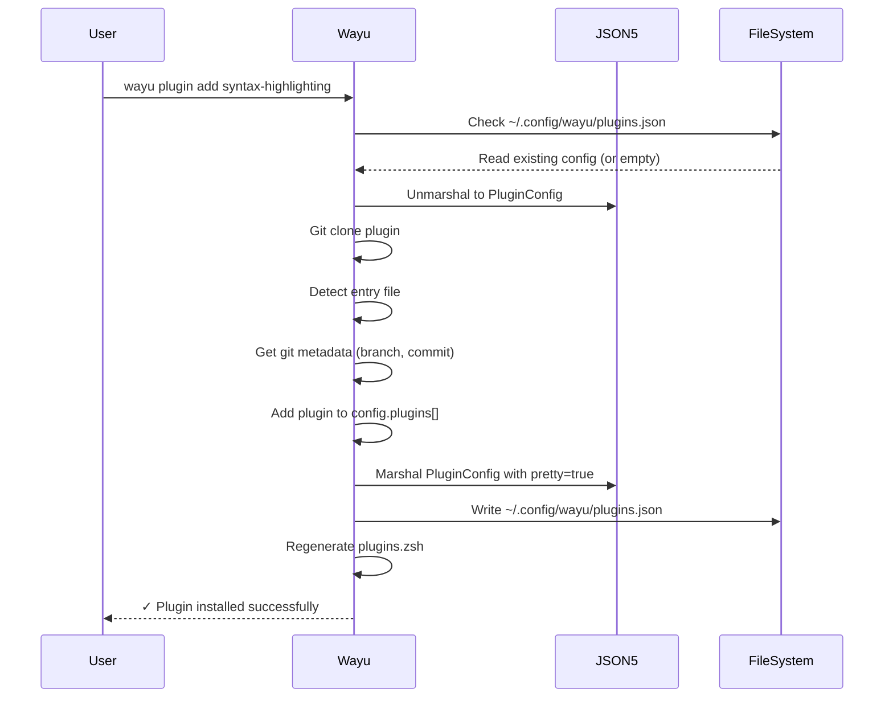
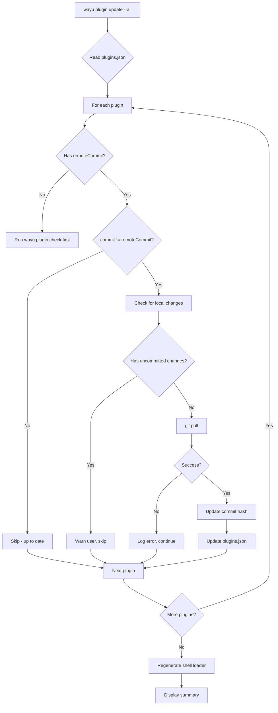
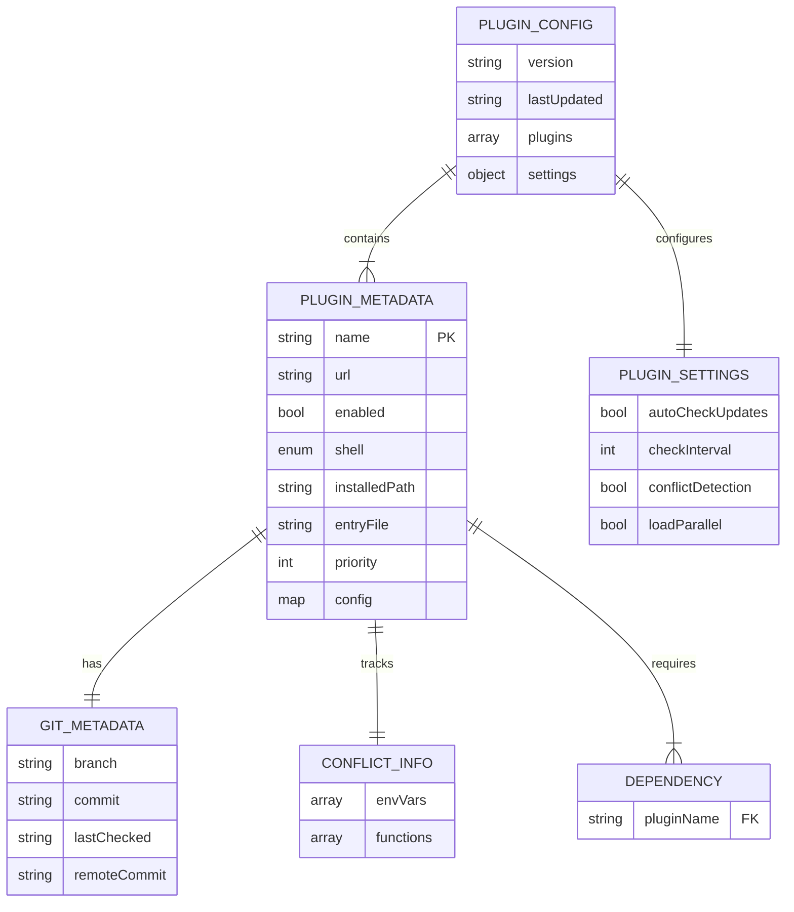

# Plugin System Enhancement - PRD

**Status**: Planning
**Version**: 1.0
**Created**: 2025-10-16
**Author**: Claude + User

---

## Executive Summary

Enhance wayu's plugin management system to provide robust configuration, update capabilities, and conflict detection. The current system has basic install/remove functionality but lacks modern plugin management features like enable/disable, updates, dependencies, and prioritization.

### Goals
1. Modern JSON5-based configuration with comments
2. Manual plugin updates with git pull
3. Enable/disable plugins without uninstalling
4. Dependency resolution between plugins
5. Load order prioritization
6. Conflict detection and warnings

### Non-Goals
- TUI interface for plugin management (future phase)
- Automatic updates in background
- Backwards compatibility with current `plugins.conf` format
- Plugin marketplace/discovery (use existing hardcoded registry)

---

## Problem Statement

### Current State

The existing plugin system (`src/plugin.odin`) provides:
- ✅ Git clone installation from URL or popular registry
- ✅ Basic `plugins.conf` file (pipe-delimited: `name|url|enabled|shell`)
- ✅ Generate shell loader script (`plugins.zsh/bash`)
- ✅ CLI commands: `add`, `remove`, `list`, `get`
- ❌ No update mechanism
- ❌ No dependency management
- ❌ No load order control
- ❌ No conflict detection
- ❌ Limited configuration per plugin

### Pain Points

1. **No updates**: Users must manually delete and re-add plugins to update
2. **No enable/disable**: Must uninstall to disable a plugin temporarily
3. **No dependencies**: Can't express "plugin A requires plugin B"
4. **No prioritization**: Load order is implicit (file system order)
5. **Conflicts go unnoticed**: Two plugins modifying same env var = silent failure
6. **Limited metadata**: Can't store plugin-specific configuration

### User Impact

**Scenario 1**: User wants to temporarily disable `zsh-autosuggestions` for debugging
- **Current**: Must run `wayu plugin rm zsh-autosuggestions`, losing configuration
- **Desired**: Run `wayu plugin disable zsh-autosuggestions`, keeps plugin installed

**Scenario 2**: User wants to update all outdated plugins
- **Current**: No way to check for updates, must manually track versions
- **Desired**: Run `wayu plugin check` → see outdated plugins → `wayu plugin update --all`

**Scenario 3**: User installs conflicting plugins
- **Current**: Both plugins load, one silently overwrites the other's config
- **Desired**: Warning at shell load: "⚠️  Conflict detected: fast-syntax-highlighting and syntax-highlighting both set ZSH_HIGHLIGHT_HIGHLIGHTERS"

---

## Solution Architecture

### Configuration File Format

**New file**: `~/.config/wayu/plugins.json` (JSON5 format)

```json5
{
  // Plugin metadata
  "version": "1.0",
  "lastUpdated": "2025-10-16T18:00:00Z",

  // Installed plugins
  "plugins": [
    {
      "name": "zsh-syntax-highlighting",
      "url": "https://github.com/zsh-users/zsh-syntax-highlighting.git",
      "enabled": true,
      "shell": "zsh",  // "zsh", "bash", "both"
      "installedPath": "~/.config/wayu/plugins/zsh-syntax-highlighting",
      "entryFile": "zsh-syntax-highlighting.plugin.zsh",

      // Git metadata
      "git": {
        "branch": "master",
        "commit": "a1b2c3d4",
        "lastChecked": "2025-10-16T17:00:00Z",
        "remoteCommit": "a1b2c3d4"  // Populated by `wayu plugin check`
      },

      // Dependencies (Phase 4)
      "dependencies": [],

      // Load priority (Phase 5: lower = earlier)
      "priority": 100,

      // Plugin-specific config (Phase 6)
      "config": {
        "ZSH_HIGHLIGHT_STYLES": "main=fg=blue",
        "ZSH_HIGHLIGHT_HIGHLIGHTERS": "main brackets"
      },

      // Conflict tracking
      "conflicts": {
        "envVars": ["ZSH_HIGHLIGHT_HIGHLIGHTERS"],
        "functions": ["_zsh_highlight"]
      }
    },
    {
      "name": "zsh-autosuggestions",
      "url": "https://github.com/zsh-users/zsh-autosuggestions.git",
      "enabled": true,
      "shell": "zsh",
      "installedPath": "~/.config/wayu/plugins/zsh-autosuggestions",
      "entryFile": "zsh-autosuggestions.zsh",
      "git": {
        "branch": "master",
        "commit": "e4f5g6h7",
        "lastChecked": "2025-10-16T17:00:00Z",
        "remoteCommit": "x9y8z7w6"  // Different! Needs update
      },
      "dependencies": [],
      "priority": 200,
      "config": {
        "ZSH_AUTOSUGGEST_HIGHLIGHT_STYLE": "fg=#808080",
        "ZSH_AUTOSUGGEST_BUFFER_MAX_SIZE": "20"
      },
      "conflicts": {
        "envVars": ["ZSH_AUTOSUGGEST_STRATEGY"],
        "functions": []
      }
    }
  ],

  // Global plugin settings
  "settings": {
    "autoCheckUpdates": false,  // Manual updates only
    "checkInterval": 604800,    // 7 days in seconds
    "conflictDetection": true,
    "loadParallel": false       // Future: concurrent loading
  }
}
```

### Data Structures (Odin)

```odin
// Enhanced plugin metadata
PluginMetadata :: struct {
    name:           string,
    url:            string,
    enabled:        bool,
    shell:          ShellCompat,
    installed_path: string,
    entry_file:     string,

    // Git metadata
    git:            GitMetadata,

    // Dependencies (Phase 4)
    dependencies:   []string,

    // Load priority (Phase 5)
    priority:       int,  // Lower = earlier, default = 100

    // Plugin-specific config (Phase 6)
    config:         map[string]string,

    // Conflict tracking
    conflicts:      ConflictInfo,
}

GitMetadata :: struct {
    branch:        string,
    commit:        string,
    last_checked:  string,  // ISO 8601 timestamp
    remote_commit: string,  // Latest remote commit (from check)
}

ConflictInfo :: struct {
    env_vars:  []string,  // Environment variables this plugin sets
    functions: []string,  // Shell functions this plugin defines
}

PluginConfig :: struct {
    version:       string,
    last_updated:  string,
    plugins:       []PluginMetadata,
    settings:      PluginSettings,
}

PluginSettings :: struct {
    auto_check_updates: bool,
    check_interval:     int,
    conflict_detection: bool,
    load_parallel:      bool,
}
```

---

## User Stories & Flows

### Phase 1: Configuration Enhancement

#### Story 1.1: Migrate to JSON5 Configuration

**As a** developer
**I want** plugin configuration in JSON5 format
**So that** I can add comments, have better structure, and use Odin's native JSON parser

**Acceptance Criteria**:
- [x] Create `PluginConfig` struct with JSON5 annotations
- [x] Implement `read_plugin_config_json()` using `core:encoding/json`
- [x] Implement `write_plugin_config_json()` with pretty-printing
- [x] Update `handle_plugin_add()` to write JSON5
- [x] Update `handle_plugin_remove()` to write JSON5
- [x] Add git metadata (branch, commit) during install
- [x] No backwards compatibility needed

**Technical Notes**:
```odin
import "core:encoding/json"

// Marshal to JSON5 with pretty-printing
marshal_plugin_config :: proc(config: ^PluginConfig) -> string {
    options := json.Marshal_Options{
        pretty = true,
        spec = .JSON5,  // Enable comments and trailing commas
    }

    data, err := json.marshal(config^, options)
    if err != nil {
        return ""
    }

    return string(data)
}

// Unmarshal from JSON5
unmarshal_plugin_config :: proc(data: string) -> (PluginConfig, bool) {
    config: PluginConfig

    err := json.unmarshal(transmute([]byte)data, &config, .JSON5)
    if err != nil {
        return {}, false
    }

    return config, true
}
```

**Flow Diagram**:



---

### Phase 2: Update System

#### Story 2.1: Check for Plugin Updates

**As a** user
**I want** to check which plugins have updates available
**So that** I know which plugins are outdated

**Acceptance Criteria**:
- [x] `wayu plugin check` lists all plugins with update status
- [x] Fetches remote HEAD commit without pulling
- [x] Compares local commit vs remote commit
- [x] Updates `plugins.json` with `remoteCommit` field
- [x] Shows table: Name | Current | Latest | Status
- [x] Exit code 0 if all up-to-date, 1 if updates available

**CLI Output**:
```
$ wayu plugin check

🔍 Checking for plugin updates...

┌────────────────────────────┬────────────┬────────────┬──────────┐
│ Plugin                     │ Current    │ Latest     │ Status   │
├────────────────────────────┼────────────┼────────────┼──────────┤
│ zsh-syntax-highlighting    │ a1b2c3d    │ a1b2c3d    │ ✓ Up-to-date │
│ zsh-autosuggestions        │ e4f5g6h    │ x9y8z7w    │ ⚠ Update available │
│ fast-syntax-highlighting   │ m3n4o5p    │ m3n4o5p    │ ✓ Up-to-date │
└────────────────────────────┴────────────┴────────────┴──────────┘

📦 1 plugin has updates available

Run 'wayu plugin update --all' to update all plugins
Run 'wayu plugin update <name>' to update specific plugin
```

**Technical Implementation**:
```odin
// Get remote HEAD commit without pulling
git_get_remote_commit :: proc(plugin_dir: string) -> (string, bool) {
    cmd := fmt.aprintf("git -C \"%s\" ls-remote origin HEAD | cut -f1", plugin_dir)
    defer delete(cmd)

    output := execute_command(cmd)
    defer delete(output)

    if len(output) < 7 {
        return "", false
    }

    // Return short commit hash (first 7 chars)
    return strings.clone(output[:7]), true
}

handle_plugin_check :: proc(args: []string) {
    config := read_plugin_config_json()
    defer cleanup_plugin_config(&config)

    needs_update_count := 0

    for &plugin in config.plugins {
        // Get remote commit
        remote_commit, ok := git_get_remote_commit(plugin.installed_path)
        if !ok {
            continue
        }

        // Update config with remote commit
        plugin.git.remote_commit = remote_commit
        plugin.git.last_checked = get_iso8601_timestamp()

        if plugin.git.commit != remote_commit {
            needs_update_count += 1
        }
    }

    // Write updated config
    write_plugin_config_json(&config)

    // Display table
    display_update_status_table(&config)

    // Exit code
    if needs_update_count > 0 {
        os.exit(1)  // Indicates updates available
    }
}
```

#### Story 2.2: Update Individual Plugin

**As a** user
**I want** to update a specific plugin
**So that** I can get the latest version

**Acceptance Criteria**:
- [x] `wayu plugin update <name>` updates specific plugin
- [x] Runs `git pull` in plugin directory
- [x] Updates local commit hash in `plugins.json`
- [x] Regenerates shell loader script
- [x] Shows before/after commit hashes
- [x] Warns if there are uncommitted local changes

**CLI Output**:
```
$ wayu plugin update zsh-autosuggestions

📦 Updating plugin: zsh-autosuggestions

Current:  e4f5g6h
Latest:   x9y8z7w

⚡ Pulling latest changes...
✓ Updated successfully

New commit: x9y8z7w
Changes:    +15 -8 files changed

ℹ️  Restart your shell or run 'source ~/.zshrc' to reload the plugin
```

#### Story 2.3: Update All Plugins

**As a** user
**I want** to update all outdated plugins at once
**So that** I don't have to update them one by one

**Acceptance Criteria**:
- [x] `wayu plugin update --all` updates all plugins with `remoteCommit != commit`
- [x] Shows progress for each plugin
- [x] Continues on error (doesn't stop if one fails)
- [x] Summary at end: X updated, Y failed, Z skipped (up-to-date)

**Flow Diagram**:



---

### Phase 3: Enable/Disable

#### Story 3.1: Disable Plugin Without Uninstalling

**As a** user
**I want** to disable a plugin temporarily
**So that** I can debug issues without losing the plugin

**Acceptance Criteria**:
- [x] `wayu plugin disable <name>` sets `enabled: false`
- [x] Plugin stays in `plugins.json`
- [x] Plugin directory stays in `~/.config/wayu/plugins/`
- [x] Regenerates shell loader (skips disabled plugins)
- [x] `wayu plugin list` shows disabled plugins with "○ Disabled" status

**CLI Output**:
```
$ wayu plugin disable zsh-autosuggestions

🔴 Disabling plugin: zsh-autosuggestions

✓ Plugin disabled successfully

The plugin will not be loaded in new shell sessions.
Restart your shell or run 'source ~/.zshrc' to apply changes.

To re-enable: wayu plugin enable zsh-autosuggestions
```

#### Story 3.2: Enable Previously Disabled Plugin

**As a** user
**I want** to re-enable a disabled plugin
**So that** I can use it again

**Acceptance Criteria**:
- [x] `wayu plugin enable <name>` sets `enabled: true`
- [x] Regenerates shell loader (includes plugin again)
- [x] No git operations needed (plugin already installed)

**Implementation**:
```odin
handle_plugin_disable :: proc(args: []string) {
    if len(args) == 0 {
        print_error("Plugin name required")
        os.exit(EXIT_USAGE)
    }

    name := args[0]

    config := read_plugin_config_json()
    defer cleanup_plugin_config(&config)

    plugin, found := find_plugin(&config, name)
    if !found {
        print_error("Plugin '%s' not found", name)
        os.exit(EXIT_GENERAL)
    }

    if !plugin.enabled {
        print_info("Plugin '%s' is already disabled", name)
        return
    }

    plugin.enabled = false

    write_plugin_config_json(&config)
    generate_plugins_file(DETECTED_SHELL)

    print_success("Plugin '%s' disabled successfully", name)
}
```

---

### Phase 4: Dependency Management

#### Story 4.1: Declare Plugin Dependencies

**As a** plugin developer
**I want** to declare that my plugin requires another plugin
**So that** wayu can install dependencies automatically

**Acceptance Criteria**:
- [x] `dependencies` array in `plugins.json`
- [x] `wayu plugin add <name>` checks dependencies
- [x] If dependency missing, prompts user to install
- [x] Option: `--with-deps` flag to auto-install dependencies

**Example**:
```json5
{
  "name": "my-custom-theme",
  "dependencies": ["zsh-syntax-highlighting", "zsh-autosuggestions"],
  // ...
}
```

**CLI Flow**:
```
$ wayu plugin add my-custom-theme

⚠️  my-custom-theme has dependencies:
   - zsh-syntax-highlighting (not installed)
   - zsh-autosuggestions (installed)

Install dependencies? [Y/n] y

📦 Installing dependency: zsh-syntax-highlighting
✓ Dependency installed

📦 Installing my-custom-theme
✓ Plugin installed successfully
```

#### Story 4.2: Validate Dependencies on Load

**As a** user
**I want** wayu to warn me if a plugin's dependencies are missing or disabled
**So that** I can fix my configuration

**Acceptance Criteria**:
- [x] During shell loader generation, check each enabled plugin's dependencies
- [x] If dependency missing: add warning comment to `plugins.zsh`
- [x] If dependency disabled: add warning comment
- [x] Warning appears in shell when sourcing `~/.zshrc`

**Generated Shell Loader**:
```zsh
#!/usr/bin/env zsh
# Auto-generated by wayu - DO NOT EDIT

# ⚠️  WARNING: Plugin 'my-custom-theme' dependency missing: zsh-syntax-highlighting
# Install with: wayu plugin add zsh-syntax-highlighting

# Load enabled plugins

# zsh-autosuggestions
if [ -f ~/.config/wayu/plugins/zsh-autosuggestions/zsh-autosuggestions.zsh ]; then
    source ~/.config/wayu/plugins/zsh-autosuggestions/zsh-autosuggestions.zsh
fi

# my-custom-theme (missing dependency: zsh-syntax-highlighting)
if [ -f ~/.config/wayu/plugins/my-custom-theme/my-custom-theme.zsh ]; then
    source ~/.config/wayu/plugins/my-custom-theme/my-custom-theme.zsh
fi
```

---

### Phase 5: Load Prioritization

#### Story 5.1: Set Plugin Load Order

**As a** user
**I want** to control the order in which plugins load
**So that** plugins with dependencies load after their dependencies

**Acceptance Criteria**:
- [x] `priority` field in `plugins.json` (default: 100)
- [x] Lower priority = loads earlier
- [x] `wayu plugin priority <name> <number>` sets priority
- [x] Shell loader sorts by priority before generating source statements

**CLI Usage**:
```
$ wayu plugin priority zsh-syntax-highlighting 10

✓ Priority set: zsh-syntax-highlighting = 10

This plugin will load earlier than plugins with priority > 10.
Run 'wayu plugin list' to see load order.
```

**List Output with Priorities**:
```
$ wayu plugin list --show-priority

┌────────────────────────────┬─────────┬──────────┬──────────┐
│ Plugin                     │ Priority│ Status   │ Shell    │
├────────────────────────────┼─────────┼──────────┼──────────┤
│ zsh-syntax-highlighting    │ 10      │ ✓ Active │ zsh      │
│ zsh-autosuggestions        │ 50      │ ✓ Active │ zsh      │
│ my-custom-theme            │ 100     │ ✓ Active │ zsh      │
└────────────────────────────┴─────────┴──────────┴──────────┘

Load order: top to bottom
```

**Implementation**:
```odin
generate_plugins_file :: proc(shell: ShellType) -> bool {
    config := read_plugin_config_json()
    defer cleanup_plugin_config(&config)

    // Sort plugins by priority (lower = earlier)
    slice.sort_by(config.plugins[:], proc(a, b: PluginMetadata) -> bool {
        return a.priority < b.priority
    })

    // Generate shell script with sorted plugins
    // ...
}
```

---

### Phase 6: Conflict Detection

#### Story 6.1: Detect Environment Variable Conflicts

**As a** user
**I want** to be warned when multiple plugins set the same environment variable
**So that** I can resolve conflicts manually

**Acceptance Criteria**:
- [x] During `generate_plugins_file()`, analyze each plugin's config
- [x] Build map of `envVar -> []pluginNames`
- [x] If `len(pluginNames) > 1`, add warning comment to shell loader
- [x] Warning appears when user sources `~/.zshrc`

**Example Conflict**:

`plugins.json`:
```json5
{
  "plugins": [
    {
      "name": "zsh-syntax-highlighting",
      "config": {
        "ZSH_HIGHLIGHT_HIGHLIGHTERS": "main brackets"
      }
    },
    {
      "name": "fast-syntax-highlighting",
      "config": {
        "ZSH_HIGHLIGHT_HIGHLIGHTERS": "main brackets pattern"
      }
    }
  ]
}
```

**Generated Shell Loader**:
```zsh
#!/usr/bin/env zsh
# Auto-generated by wayu - DO NOT EDIT

# ⚠️  CONFLICT DETECTED
# The following environment variables are set by multiple plugins:
#   ZSH_HIGHLIGHT_HIGHLIGHTERS:
#     - zsh-syntax-highlighting
#     - fast-syntax-highlighting
# Last plugin wins. Consider disabling one of them.

# zsh-syntax-highlighting
export ZSH_HIGHLIGHT_HIGHLIGHTERS="main brackets"
if [ -f ~/.config/wayu/plugins/zsh-syntax-highlighting/zsh-syntax-highlighting.zsh ]; then
    source ~/.config/wayu/plugins/zsh-syntax-highlighting/zsh-syntax-highlighting.zsh
fi

# fast-syntax-highlighting
export ZSH_HIGHLIGHT_HIGHLIGHTERS="main brackets pattern"  # ⚠️  Overwrites previous value
if [ -f ~/.config/wayu/plugins/fast-syntax-highlighting/fast-syntax-highlighting.zsh ]; then
    source ~/.config/wayu/plugins/fast-syntax-highlighting/fast-syntax-highlighting.zsh
fi
```

**Implementation**:
```odin
ConflictMap :: map[string][dynamic]string  // envVar -> plugin names

detect_env_conflicts :: proc(config: ^PluginConfig) -> ConflictMap {
    conflicts := make(ConflictMap)

    for plugin in config.plugins {
        if !plugin.enabled {
            continue
        }

        for env_var, _ in plugin.config {
            if env_var not_in conflicts {
                conflicts[env_var] = make([dynamic]string)
            }
            append(&conflicts[env_var], plugin.name)
        }
    }

    // Filter to only conflicts (>1 plugin)
    filtered := make(ConflictMap)
    for env_var, plugin_names in conflicts {
        if len(plugin_names) > 1 {
            filtered[env_var] = plugin_names
        }
    }

    return filtered
}
```

---

## API Specifications

### Command Line Interface

#### New Commands

```bash
# Check for updates
wayu plugin check                 # Check all plugins
wayu plugin check <name>          # Check specific plugin

# Update plugins
wayu plugin update <name>         # Update specific plugin
wayu plugin update --all          # Update all outdated plugins

# Enable/Disable
wayu plugin enable <name>         # Enable disabled plugin
wayu plugin disable <name>        # Disable without uninstalling

# Prioritization
wayu plugin priority <name> <num> # Set load priority (default: 100)

# Enhanced list
wayu plugin list --show-priority  # Show with priorities
wayu plugin list --outdated       # Show only outdated plugins
```

#### Modified Commands

```bash
# Add with dependencies
wayu plugin add <name>            # Prompts for dependencies
wayu plugin add <name> --with-deps # Auto-install dependencies
wayu plugin add <name> --no-deps   # Skip dependency check

# Remove with cascade
wayu plugin rm <name>              # Warns if other plugins depend on it
wayu plugin rm <name> --force      # Remove even if dependencies exist
```

---

## Implementation Phases

### Phase 1: Configuration Foundation (Priority 1)
**Duration**: 2-3 days

**Tasks**:
1. Define Odin structs for new `PluginConfig` format
2. Implement JSON5 marshaling/unmarshaling using `core:encoding/json`
3. Create `read_plugin_config_json()` and `write_plugin_config_json()`
4. Update `handle_plugin_add()` to write JSON5 with git metadata
5. Update `handle_plugin_remove()` to write JSON5
6. Update `handle_plugin_list()` to read from JSON5
7. Update `generate_plugins_file()` to use new config
8. Add unit tests for config read/write

**Deliverables**:
- ✅ `plugins.json` replaces `plugins.conf`
- ✅ All existing commands work with new format
- ✅ Git metadata captured (branch, commit)

---

### Phase 2: Update System (Priority 2)
**Duration**: 3-4 days

**Tasks**:
1. Implement `git_get_remote_commit()` using `git ls-remote`
2. Create `handle_plugin_check()`
   - Fetch remote commits for all plugins
   - Update `plugins.json` with `remoteCommit`
   - Display table with update status
3. Create `handle_plugin_update()`
   - Support `<name>` and `--all` flag
   - Run `git pull` in plugin directory
   - Update local commit hash
   - Regenerate shell loader
4. Add `git_check_local_changes()` to warn about uncommitted changes
5. Add progress spinner for long operations
6. Add unit tests for update logic

**Deliverables**:
- ✅ `wayu plugin check` command
- ✅ `wayu plugin update <name>` command
- ✅ `wayu plugin update --all` command
- ✅ Warning for uncommitted local changes

---

### Phase 3: Enable/Disable (Priority 3)
**Duration**: 1-2 days

**Tasks**:
1. Create `handle_plugin_enable()`
2. Create `handle_plugin_disable()`
3. Update `generate_plugins_file()` to skip disabled plugins
4. Update `handle_plugin_list()` to show disabled status
5. Add tests for enable/disable flow

**Deliverables**:
- ✅ `wayu plugin enable <name>` command
- ✅ `wayu plugin disable <name>` command
- ✅ Disabled plugins persist in config

---

### Phase 4: Dependency Management (Priority 4)
**Duration**: 3-4 days

**Tasks**:
1. Add `dependencies: []string` field to `PluginMetadata`
2. Create `validate_dependencies()` helper
3. Update `handle_plugin_add()` to check dependencies
   - Detect missing dependencies
   - Prompt user to install
   - Support `--with-deps` flag
4. Create `install_dependency()` helper (recursive)
5. Update `generate_plugins_file()` to validate dependencies
   - Add warning comments for missing deps
   - Add warning comments for disabled deps
6. Update `handle_plugin_remove()` to warn about dependent plugins
7. Add tests for dependency resolution

**Deliverables**:
- ✅ Dependency declaration in `plugins.json`
- ✅ Automatic dependency installation (opt-in)
- ✅ Dependency validation warnings in shell loader

---

### Phase 5: Load Prioritization (Priority 5)
**Duration**: 2 days

**Tasks**:
1. Add `priority: int` field to `PluginMetadata` (default: 100)
2. Create `handle_plugin_priority()` command
3. Update `generate_plugins_file()` to sort by priority
4. Add `--show-priority` flag to `handle_plugin_list()`
5. Add tests for priority sorting

**Deliverables**:
- ✅ `wayu plugin priority <name> <number>` command
- ✅ Plugins load in priority order (lower = earlier)
- ✅ `wayu plugin list --show-priority` shows load order

---

### Phase 6: Conflict Detection (Priority 6)
**Duration**: 3 days

**Tasks**:
1. Add `conflicts: ConflictInfo` field to `PluginMetadata`
2. Create `detect_env_conflicts()` helper
3. Update `generate_plugins_file()` to detect conflicts
   - Build conflict map
   - Add warning comments to shell loader
4. Create `detect_function_conflicts()` (scan plugin files for function definitions)
5. Add `--check-conflicts` flag to `wayu plugin check`
6. Add tests for conflict detection

**Deliverables**:
- ✅ Environment variable conflict warnings in shell loader
- ✅ Function conflict warnings (basic detection)
- ✅ User notified at shell load time

---

## Data Model

### Entity Relationship Diagram



---

## Risk Mitigation

### Risk 1: JSON5 Parsing Errors
**Likelihood**: Medium
**Impact**: High
**Mitigation**:
- Validate JSON5 structure before writing
- Keep backup of previous `plugins.json` before writing
- Provide clear error messages with line numbers
- Add `wayu plugin validate` command to check config integrity

### Risk 2: Git Operations Fail
**Likelihood**: High (network issues, auth, etc.)
**Impact**: Medium
**Mitigation**:
- Graceful error handling (don't exit on single plugin failure)
- Timeout for git operations (30s)
- Show detailed git error output to user
- Support `--verbose` flag for debugging

### Risk 3: Circular Dependencies
**Likelihood**: Low
**Impact**: Medium
**Mitigation**:
- Detect circular dependencies before installing
- Refuse installation if circular dependency detected
- Provide clear error message with dependency chain

### Risk 4: Conflict Detection False Positives
**Likelihood**: Medium
**Impact**: Low
**Mitigation**:
- Make conflict detection opt-in (default: on, but can disable)
- Provide `--ignore-conflicts` flag
- Allow user to mark conflicts as "known and safe"

---

## Success Metrics

### Quantitative
1. **Update adoption**: >70% of users run `wayu plugin update` within 7 days of release
2. **Disable usage**: >30% of users use `enable/disable` instead of `remove/add`
3. **Dependency resolution**: 0 failed installs due to missing dependencies
4. **Conflict detection**: >50% of conflicts detected before shell load failure

### Qualitative
1. **User feedback**: "I can finally manage my plugins properly"
2. **No regressions**: All existing plugin commands still work
3. **Performance**: Config read/write <50ms on average system

---

## Appendix

### A. Example `plugins.json` (Full)

```json5
{
  // wayu plugin configuration
  "version": "1.0",
  "lastUpdated": "2025-10-16T18:00:00Z",

  "plugins": [
    {
      "name": "zsh-syntax-highlighting",
      "url": "https://github.com/zsh-users/zsh-syntax-highlighting.git",
      "enabled": true,
      "shell": "zsh",
      "installedPath": "/Users/user/.config/wayu/plugins/zsh-syntax-highlighting",
      "entryFile": "zsh-syntax-highlighting.plugin.zsh",
      "git": {
        "branch": "master",
        "commit": "a1b2c3d",
        "lastChecked": "2025-10-16T17:00:00Z",
        "remoteCommit": "a1b2c3d"
      },
      "dependencies": [],
      "priority": 10,  // Load early
      "config": {
        "ZSH_HIGHLIGHT_STYLES": "main=fg=blue",
        "ZSH_HIGHLIGHT_HIGHLIGHTERS": "main brackets"
      },
      "conflicts": {
        "envVars": ["ZSH_HIGHLIGHT_HIGHLIGHTERS", "ZSH_HIGHLIGHT_STYLES"],
        "functions": ["_zsh_highlight"]
      }
    },
    {
      "name": "zsh-autosuggestions",
      "url": "https://github.com/zsh-users/zsh-autosuggestions.git",
      "enabled": true,
      "shell": "zsh",
      "installedPath": "/Users/user/.config/wayu/plugins/zsh-autosuggestions",
      "entryFile": "zsh-autosuggestions.zsh",
      "git": {
        "branch": "master",
        "commit": "e4f5g6h",
        "lastChecked": "2025-10-16T17:00:00Z",
        "remoteCommit": "x9y8z7w"  // Needs update!
      },
      "dependencies": [],
      "priority": 50,
      "config": {
        "ZSH_AUTOSUGGEST_HIGHLIGHT_STYLE": "fg=#808080",
        "ZSH_AUTOSUGGEST_BUFFER_MAX_SIZE": "20",
        "ZSH_AUTOSUGGEST_USE_ASYNC": "1"
      },
      "conflicts": {
        "envVars": ["ZSH_AUTOSUGGEST_STRATEGY"],
        "functions": []
      }
    },
    {
      "name": "my-custom-theme",
      "url": "https://github.com/user/my-custom-theme.git",
      "enabled": true,
      "shell": "zsh",
      "installedPath": "/Users/user/.config/wayu/plugins/my-custom-theme",
      "entryFile": "my-custom-theme.zsh",
      "git": {
        "branch": "main",
        "commit": "z9y8x7w",
        "lastChecked": "2025-10-16T17:00:00Z",
        "remoteCommit": "z9y8x7w"
      },
      "dependencies": [
        "zsh-syntax-highlighting",  // Required
        "zsh-autosuggestions"       // Required
      ],
      "priority": 100,  // Load after dependencies
      "config": {},
      "conflicts": {
        "envVars": ["PROMPT"],
        "functions": ["precmd"]
      }
    },
    {
      "name": "z-jump",
      "url": "https://github.com/rupa/z.git",
      "enabled": false,  // Disabled for testing
      "shell": "both",
      "installedPath": "/Users/user/.config/wayu/plugins/z",
      "entryFile": "z.sh",
      "git": {
        "branch": "master",
        "commit": "m3n4o5p",
        "lastChecked": "2025-10-15T12:00:00Z",
        "remoteCommit": "m3n4o5p"
      },
      "dependencies": [],
      "priority": 100,
      "config": {},
      "conflicts": {
        "envVars": ["_Z_DATA"],
        "functions": ["z", "_z"]
      }
    }
  ],

  "settings": {
    "autoCheckUpdates": false,
    "checkInterval": 604800,  // 7 days
    "conflictDetection": true,
    "loadParallel": false
  }
}
```

### B. Generated Shell Loader Example

```zsh
#!/usr/bin/env zsh
# Auto-generated by wayu - DO NOT EDIT
# Last updated: 2025-10-16 18:00:00

# ⚠️  CONFLICT DETECTED
# The following environment variables are set by multiple plugins:
#   PROMPT:
#     - my-custom-theme
# Consider reviewing your plugin configuration.

# ⚠️  WARNING: Plugin 'my-custom-theme' has dependencies:
#   - zsh-syntax-highlighting (✓ installed, ✓ enabled)
#   - zsh-autosuggestions (✓ installed, ✓ enabled)

# Load enabled plugins (sorted by priority)

# Plugin: zsh-syntax-highlighting (priority: 10)
export ZSH_HIGHLIGHT_STYLES="main=fg=blue"
export ZSH_HIGHLIGHT_HIGHLIGHTERS="main brackets"
if [ -f "/Users/user/.config/wayu/plugins/zsh-syntax-highlighting/zsh-syntax-highlighting.plugin.zsh" ]; then
    source "/Users/user/.config/wayu/plugins/zsh-syntax-highlighting/zsh-syntax-highlighting.plugin.zsh"
fi

# Plugin: zsh-autosuggestions (priority: 50)
export ZSH_AUTOSUGGEST_HIGHLIGHT_STYLE="fg=#808080"
export ZSH_AUTOSUGGEST_BUFFER_MAX_SIZE="20"
export ZSH_AUTOSUGGEST_USE_ASYNC="1"
if [ -f "/Users/user/.config/wayu/plugins/zsh-autosuggestions/zsh-autosuggestions.zsh" ]; then
    source "/Users/user/.config/wayu/plugins/zsh-autosuggestions/zsh-autosuggestions.zsh"
fi

# Plugin: my-custom-theme (priority: 100)
export PROMPT="%F{blue}%~%f $ "  # ⚠️  May conflict with other prompts
if [ -f "/Users/user/.config/wayu/plugins/my-custom-theme/my-custom-theme.zsh" ]; then
    source "/Users/user/.config/wayu/plugins/my-custom-theme/my-custom-theme.zsh"
fi

# End of plugin loading
# 3 plugins loaded (1 disabled: z-jump)
```

### C. CLI Command Reference

```bash
# Configuration & Status
wayu plugin list                      # List all plugins
wayu plugin list --show-priority      # List with load order
wayu plugin list --outdated           # List plugins needing updates
wayu plugin get <name>                # Show plugin details + copy URL

# Installation & Removal
wayu plugin add <name>                # Install plugin (prompt for deps)
wayu plugin add <name> --with-deps    # Install with auto-deps
wayu plugin add <name> --no-deps      # Install without dep check
wayu plugin add <url>                 # Install from custom URL
wayu plugin rm <name>                 # Remove plugin (warn if dependencies)
wayu plugin rm <name> --force         # Remove even if deps exist

# Updates
wayu plugin check                     # Check all for updates
wayu plugin check <name>              # Check specific plugin
wayu plugin update <name>             # Update specific plugin
wayu plugin update --all              # Update all outdated plugins

# Enable/Disable
wayu plugin enable <name>             # Enable disabled plugin
wayu plugin disable <name>            # Disable without removing

# Configuration
wayu plugin priority <name> <num>     # Set load priority
wayu plugin validate                  # Validate plugins.json integrity

# Help
wayu plugin help                      # Show help
```

---

## Next Steps

After this PRD is approved:

1. **Implementation PRP**: Create detailed implementation plan with code samples
2. **Testing Strategy**: Define unit tests, integration tests, and manual test cases
3. **Documentation**: Update README.md and CLAUDE.md with new commands
4. **Migration Guide**: If needed, create guide for users (though no current users)

---

**End of PRD**
